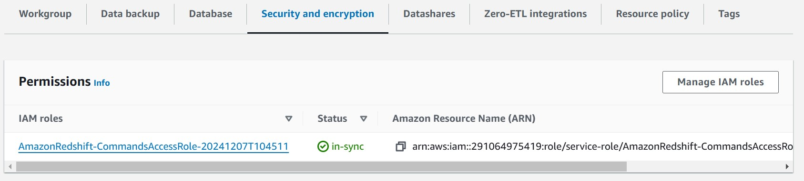
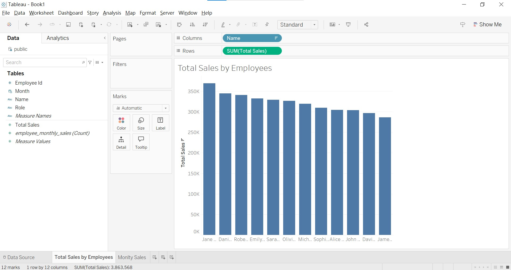

# Redshift & Tableau Analytics Demo  
**Updated at**: December 7, 2024  

This repository demonstrates the basic setup of Amazon Redshift, showcasing a report for the Software Architectures for Collaborative Systems course [D0R29a] at KU Leuven: **Building the Data Warehouse: AWS Redshift as an Example**. A partial portion of the code and data is provided in the README as an example. All the code and data used in this demonstration are included in this repository for reference.

### Scenario: Retail Chain with Separate Systems  
A retail chain operates separate systems for managing sales, employee information, and product catalogs:

- **Sales System (POS)**: Tracks transaction data, including products sold, store location, and the employee responsible.
- **Employee System (HR)**: Stores employee details such as ID, name, role, salary, and hire date.
- **Product Catalog System**: Manages product information, including product ID, name, category, and price.

These systems are not integrated into an ERP. Instead, data from each system is extracted, transformed, and loaded into a data warehouse through an ETL process. The data warehouse consolidates the data from the various systems, enabling cross-functional analysis, such as evaluating sales performance, employee success, and product trends.

Even if data is stored in an ERP system with an OLTP database optimized for real-time transactions, it may not be suitable for complex analytical queries. A data warehouse, designed with OLAP principles, is better for querying and reporting, enabling efficient analysis of large datasets. This provides superior performance for tasks like trend analysis and business intelligence, even if the ERP is the single data source.

### Data: Star Schema  

The star schema used in this demonstration consists of the following tables:

- **Sales Table**: The fact table containing transaction records, with `store_id`, `employee_id`, and `product_id` as foreign keys.
- **Store Table**: A dimension table containing details about each store.
- **Employee Table**: A dimension table containing details about employees.
- **Product Table**: A dimension table containing details about products.

The **Sales** table references the **Store**, **Employee**, and **Product** tables, enabling detailed analysis of sales by store, employee, or product.


### Amazon Redshift Setup  
At the web page of Amazon Redshift Serverless, create a workgroup and a namespace within it. The namespace is a collection of databases. In this demo, they are `default-workgroup` and `default-namespace`.


### Create Database and Tables  
After the namespace is created, right-click **Query data** to access the **Redshift Query Editor v2**, where you can use a graphical interface for operations. At the same time, you can utilize the SQL notebook to execute SQL queries.  

> **Note**: Ensure that you select the correct workgroup and database (the two dropdown buttons next to `Run ALL`) to run SQL queries.


```{sql}
CREATE DATABASE sales_performances_dev;
```

Given the sample data, the tables are defined with distribution styles and sort keys. Below is the definition of the `sales` table:

```sql
CREATE TABLE sales (
    employee_id INT PRIMARY KEY,
    sale_id INT,
    store_id INT,
    product_id INT,
    sale_date DATE,
    quantity INT,
    unit_price INT,
    total_amount DECIMAL(10, 2),
    FOREIGN KEY (store_id) REFERENCES stores(store_id),
    FOREIGN KEY (employee_id) REFERENCES employees(employee_id),
    FOREIGN KEY (product_id) REFERENCES products(product_id)
)
DISTKEY (employee_id)
SORTKEY (sale_date);
```

### Load Data

The approach I conducted was loading data into Redshift from S3 using the `COPY` command in the editor.

The 4 CSV files are uploaded to the S3 bucket: `redshift-project`.

Before using the `COPY` command, ensure the following prerequisites are met:
- Attach the IAM role for the `COPY` command to the namespace under **Manage IAM roles** in the **Security and Encryption** section:
  - Create an AWS service role with `AmazonRedshiftAllCommandsFullAccess` (or equivalent permissions).
  - Ensure the service role has permissions to access the S3 bucket.




Take table `sales` as an example:
```sql
COPY sales(sale_id, store_id, employee_id, product_id, sale_date, quantity, unit_price, total_amount) -- specify the field order in the file
    FROM 's3://redshift-project/sales.csv' 
    DELIMITER ',' 
    CSV
    IGNOREHEADER 1
    DATEFORMAT 'YYYY-MM-DD' 
    REGION 'eu-west-2'
    IAM_ROLE 'your-IAM-role';
```
### Create Views for Visualization in Tableau
Tableau can directly access the tables if the user has the necessary permissions. However, since Redshift is a data warehouse, calculations for visualizations should be performed in Redshift. Therefore, creating views for Tableau and granting the appropriate access is the proper approach. I created a sql view for montlhy sales for each employee in the year 2024.

I created a SQL view `employee_monthly_sales` for monthly sales for each employee in the year 2024.

```sql
CREATE VIEW employee_monthly_sales AS(
    with employee_monthly_sales_by_id as(
        select 
            sales.employee_id,
            DATE_TRUNC('month', sales.sale_date) AS month,
            sum(sales.total_amount) as total_sales
        FROM
            sales
        WHERE
            DATE_PART('year', sales.sale_date) = 2024
        GROUP BY
            sales.employee_id, month
        ORDER BY
            sales.employee_id, sum(sales.total_amount) DESC
    )

    SELECT
        e.employee_id,
        e.name,
        e.role,
        em.month,
        em.total_sales
    from 
        employees as e
        left join employee_monthly_sales_by_id as em
            on e.employee_id = em.employee_id
)
```
```sql
CREATE VIEW employee_monthly_sales AS
    SELECT
        e.employee_id, e.name, e.role,
        DATE_TRUNC('month', s.sale_date) AS month,
        SUM(s.total_amount) AS total_sales
    FROM
        sales s
        LEFT JOIN employees as e 
            ON s.employee_id = e.employee_id
    WHERE
        DATE_PART('year', s.sale_date) = 2024
    GROUP BY
        e.employee_id, e.name, e.role, month;
```
After the view is created, you have to create a user, and grant the user's access to the view.

```sql
CREATE USER tableau_user PASSWORD 'your-password';
GRANT SELECT ON public.employee_monthly_sales TO tableau_user;
```

### Connect to Tableau Desktop
#### Setup in Redshift
This is the most challenging part. To access Tableau using a personal laptop, you need to ensure the following configurations are in place:
1. Make your workspace publicly accessible in the **Configuration** settings of the workspace.
2. Ensure your VPC security group has an inbound rule that allows your connection.


Edit the **Network and security** settings under **Data access** to make the namespace publicly accessible. After that, click on the **VPC security group**, and set up an inbound rule to accept all IP addresses and ports.


#### Setup in the Laptop

The connection from Tableau to Redshift is made through the Amazon Redshift ODBC driver, which you need to download before connecting. Follow the instructions here: [ODBC Driver Installation](https://docs.aws.amazon.com/redshift/latest/mgmt/odbc-driver-windows-how-to-install.html).


Open Tableau Desktop, add a connection to Amazon Redshift, and enter the server address, port, database, and username and password you created in the **Redshift Query Editor v2**. The server endpoint can be found at the configuration page of the workgroup (display in the image above).


### Data Visualization

Now, you are at the end of the demonstration. Once Tableau successfully connects to Redshift, you can visualize the performance of employees' monthly and yearly sales in 2024.

Drag the view you created (shown as a table in Tableau) to the data source.


Then, you can visualize the performance of employees' monthly and yearly sales in 2024.




## Conclusion
This demonstration has shown how to set up Amazon Redshift, load data from S3, and create views to facilitate advanced analytics. By connecting Tableau to Redshift, we've created a seamless workflow that allows for efficient and insightful visualizations of employee performance and sales trends.

With the proper setup and connections, you can now perform powerful analyses on your data warehouse, gaining valuable insights that can drive business decisions. Tableau’s intuitive interface, combined with Redshift’s powerful data storage and querying capabilities, provides a robust solution for data visualization and business intelligence.

Whether you're tracking employee sales, evaluating product trends, or analyzing store performance, this approach provides the foundation for creating actionable insights that can support strategic decisions within your organization.